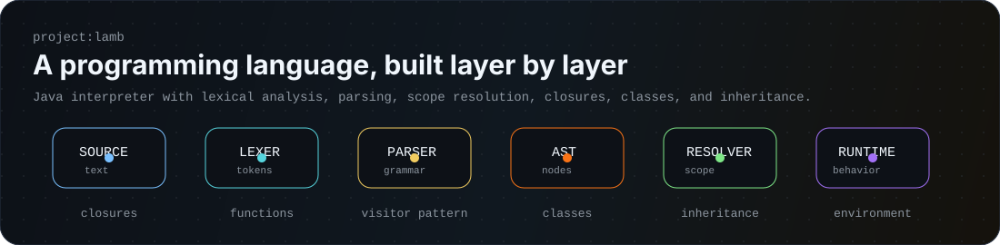

<p align="center">
  
</p>

<h3 align="center">I enjoy understanding the layers beneath the software I build.</h3>

<p align="center">
  <code>CS Student</code>
  &nbsp;|&nbsp;
  <code>700+ DSA Problems</code>
  &nbsp;|&nbsp;
  <code>Lamb Interpreter</code>
  &nbsp;|&nbsp;
  <code>xv6</code>
  &nbsp;|&nbsp;
  <code>TCP Servers</code>
</p>

---

## ./intro

I am a Computer Science student who likes building things that make computers feel less like black boxes.

My story is not about collecting frameworks. It is about asking what happens underneath: how source code becomes behavior, how a server handles connections, how memory and processes are managed, and how small design choices turn into system architecture.

I have solved 700+ DSA problems because I believe clear thinking and strong problem solving come before fancy technologies.

```txt
source code   -> tokens -> grammar -> AST -> runtime
packet stream -> socket -> protocol -> state -> response
program       -> syscall -> kernel -> scheduler -> hardware
```

## ./currently-exploring

<table>
  <tr>
    <td width="25%"><strong>Operating Systems</strong><br><sub>xv6, processes, traps, syscalls, scheduling</sub></td>
    <td width="25%"><strong>Networking</strong><br><sub>TCP, sockets, server state, message flow</sub></td>
    <td width="25%"><strong>Language Design</strong><br><sub>parsing, scope, closures, runtime environments</sub></td>
    <td width="25%"><strong>Architecture</strong><br><sub>interfaces, boundaries, maintainability</sub></td>
  </tr>
</table>

## ./systems-map

<p align="center">
  
</p>

## ./things-built

### Lamb

An interpreted programming language written in Java.

<p align="center">
  
</p>

Building Lamb helped me understand how a language is shaped from the inside:

- Lexer
- Recursive descent parser
- AST generation
- Visitor pattern
- Resolver
- Functions and closures
- Classes and inheritance
- Runtime environment

### TCP Chat Server

A networking project focused on how clients communicate over TCP, how messages move through sockets, and how server-side state is managed across connections.

### Problem Solving

700+ DSA problems solved as deliberate practice in reasoning, pattern recognition, and implementation discipline. For me, DSA is not about streaks; it is practice for thinking clearly under constraints.

## ./learning-now

```txt
xv6              kernel structure, traps, syscalls, scheduler behavior
networking       TCP/IP, socket programming, client-server communication
interpreters     parsing, resolving names, closures, object models
backend systems  clean interfaces, state flow, long-term maintainability
```

I do not want to become someone who only knows frameworks. I want to understand why things work internally.

## ./technologies

I try to keep tools in their place: useful, but secondary to understanding the system.

<p>
  
  
  
  
  
  
  
  
</p>

<table>
  <tr>
    <td><code>core</code></td>
    <td>Data structures, algorithms, operating systems, networking, compilers</td>
  </tr>
  <tr>
    <td><code>backend</code></td>
    <td>APIs, server-side logic, state management, architecture boundaries</td>
  </tr>
  <tr>
    <td><code>web basics</code></td>
    <td>HTML, CSS, JavaScript</td>
  </tr>
</table>

## ./debug-break

<p align="center">
  
</p>

## ./contact

<p>
  <a href="https://www.linkedin.com/in/deebyanshujha/"></a>
  <a href="mailto:jhadeebyanshu@gmail.com"></a>
  <a href="https://leetcode.com/u/deebyanshujha/"></a>
  <a href="https://www.hackerrank.com/profile/jhadeebyanshu"></a>
  <a href="https://codolio.com/profile/deebyanshujha"></a>
</p>

---

<p align="center">
  <sub>Still learning, still building, and still trying to understand one layer deeper.</sub>
</p>
