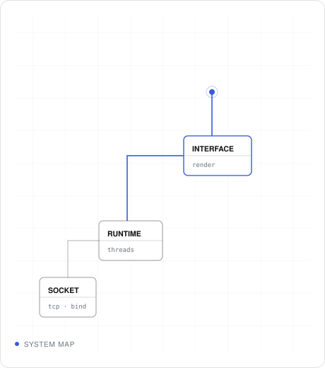
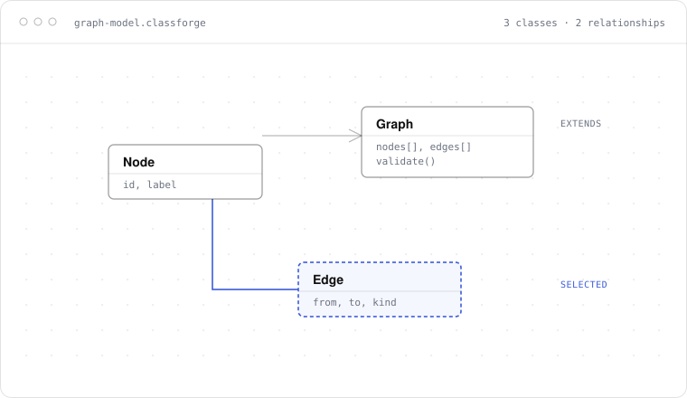
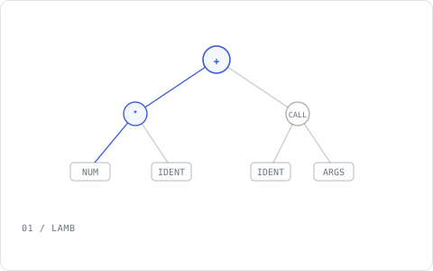
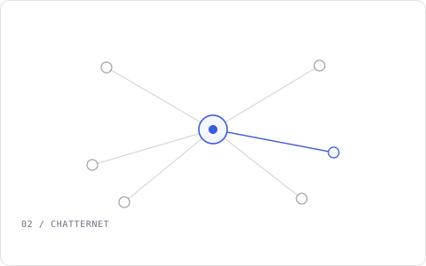
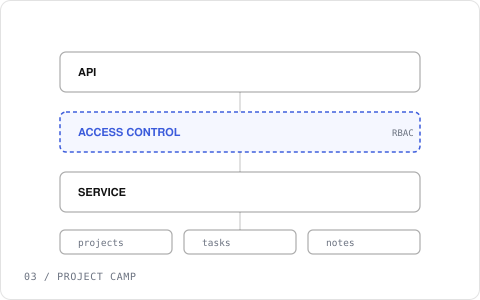

<table>
<tr>
<td width="58%" valign="top">

# DEEBYANSHU JHA

### SOFTWARE ENGINEER — BUILDING FROM SOCKET TO SCREEN.

I build systems end to end — from low-level networking to interfaces people actually use. Understanding a layer means implementing it, not reading about it.

 **Shipped [ClassForge](https://classforge-one.vercel.app/)**

GitHub · LinkedIn · Email
 [github.com/deebyanshujha](https://github.com/deebyanshujha) &nbsp;·&nbsp; [linkedin.com/in/deebyanshujha](https://www.linkedin.com/in/deebyanshujha/) &nbsp;·&nbsp; [jhadeebyanshu@gmail.com](mailto:jhadeebyanshu@gmail.com)

Vellore, IN &nbsp;·&nbsp; UTC+5:30

</td>
<td width="42%" align="right" valign="top">

</td>
</tr>
</table>

  

 UML CLASS DIAGRAM EDITOR

# Design UML diagrams. Think in systems.

<table>
<tr>
<td width="62%" valign="top">

ClassForge treats the diagram as a language instead of a picture of one — native notation, relationships that understand what they connect, and a canvas with nothing else competing for attention.

NODES &nbsp;|&nbsp; EDGES &nbsp;|&nbsp; RELATIONSHIPS &nbsp;|&nbsp; VALIDATION &nbsp;|&nbsp; EXPORT

</td>
<td width="38%" align="right" valign="top">

[Open editor →](https://classforge-one.vercel.app/)

</td>
</tr>
</table>

  

## Selected work

<table>
<tr>
<td width="58%" valign="top">

01 / LAMB

### Lamb
Tree-walking interpreter for the JVM. Lexer, recursive-descent parser, AST, resolver, closures, classes, inheritance — the fastest way to understand language design turned out to be implementing one.

JAVA &nbsp;|&nbsp; JVM &nbsp;|&nbsp; INTERPRETER &nbsp;·&nbsp; [source →](https://github.com/deebyanshujha/Lamb)

</td>
<td width="42%" valign="top">

</td>
</tr>
</table>

 

02 / CHATTERNET

### ChatterNet
Multi-threaded TCP group chat server. Concurrent clients, one thread per connection, live broadcast to the room — no framework between the code and the wire.

C++ &nbsp;|&nbsp; TCP &nbsp;|&nbsp; SYSTEMS &nbsp;·&nbsp; [source →](https://github.com/deebyanshujha/ChatterNet)

  

<table>
<tr>
<td width="42%" valign="top">

</td>
<td width="58%" valign="top">

03 / PROJECT CAMP

### Project Camp
Project-management backend with role-based access control. Projects, tasks, subtasks, notes — a permission model designed the way a real product needs, not a tutorial's.

NODE &nbsp;|&nbsp; REST &nbsp;|&nbsp; RBAC &nbsp;·&nbsp; [source →](https://github.com/deebyanshujha/Project_camp)

</td>
</tr>
</table>

 

**Portfolio** — the site this profile links back to. REACT &nbsp;|&nbsp; TYPESCRIPT &nbsp;·&nbsp; [deebyanshujha.github.io/my_portfolio →](https://deebyanshujha.github.io/my_portfolio/)

  

## The lab
interaction &nbsp;·&nbsp; developer tooling &nbsp;·&nbsp; visual systems &nbsp;·&nbsp; interface experiments

**xv6 internals** — tracing syscalls, traps, and scheduler behaviour through a real kernel, source first.
 **Rapid Recall** — a turn-based multiplayer word game; an excuse to think about live-state UI and timing.
 **Placement Predictor** — a small supervised model over placement outcomes, returning a probability, not a verdict.
 **Movie Recommender** — a Chrome extension surfacing one film per popup, pulled from OMDB.

  

## How I build

01

### REDUCE BEFORE ADDING.

02

### MAKE COMPLEXITY OBVIOUS.

03

### BUILD FROM FIRST PRINCIPLES.

04

### LET THE INTERFACE EXPLAIN ITSELF.

 

## Stack

<table>
<tr>
<td valign="top">

**FRONTEND**
 React &nbsp;|&nbsp; TypeScript

</td>
<td valign="top">

**BACKEND**
 Node &nbsp;|&nbsp; Java

</td>
<td valign="top">

**SYSTEMS**
 C++ &nbsp;|&nbsp; JVM &nbsp;|&nbsp; TCP

</td>
<td valign="top">

**TOOLS**
 Git &nbsp;|&nbsp; Linux

</td>
</tr>
</table>

 

Contribution activity

<picture>
  <source media="(prefers-color-scheme: dark)" srcset="https://github-readme-activity-graph.vercel.app/graph?username=deebyanshujha&bg_color=0d1117&color=8a8a86&line=6E8FF0&point=6E8FF0&area=true&area_color=6E8FF0&hide_border=true&title_color=8a8a86&custom_title=" />
  
</picture>

  

**DEEBYANSHU JHA**
 BUILDING THINGS WORTH USING.

GitHub · LinkedIn · Email
 [github.com/deebyanshujha](https://github.com/deebyanshujha) &nbsp;·&nbsp; [linkedin.com/in/deebyanshujha](https://www.linkedin.com/in/deebyanshujha/) &nbsp;·&nbsp; [jhadeebyanshu@gmail.com](mailto:jhadeebyanshu@gmail.com)
