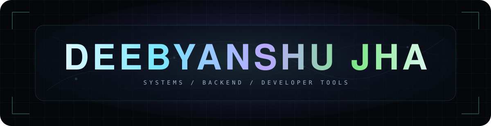

 

<h1 align="center">
  
</h1>

 

 

Building software systems, developer tools, and applications — from interpreters and networking systems to modern desktop software.

  

  

  

01 / ABOUT

---

I'm a third-year Computer Science student at VIT Vellore, pursuing a B.Tech in CSE with Internet of Things and holding a 9.12/10 CGPA. I like understanding how software works under the hood and then building it myself. Most of my projects end up somewhere between software engineering, systems, backend engineering, networking, developer tools, desktop applications, and interpreters, with 700+ DSA problems along the way.

SYSTEMS · BACKEND · NETWORKING · DESKTOP · LANGUAGE TOOLS

 

02 / PROJECTS

---

<table width="100%">
<tr>
<td width="50%" valign="top">
01
<h3>🐑 LAMB</h3>
TREE-WALK INTERPRETER · LANGUAGE RUNTIME

<code>SCAN → PARSE → AST → RESOLVE → RUN</code>

A dynamically typed language built on the JVM in Java, with lexing, parsing, ASTs, resolution, closures, classes, inheritance, and tree-walking evaluation.

JAVA · AST · PARSING · INTERPRETER

<a href="https://github.com/deebyanshujha/Lamb">VIEW REPOSITORY →</a> &nbsp; <a href="https://deebyanshujha.github.io/docs-lamb/">DOCS →</a>

</td>
<td width="50%" valign="top">
02
<h3>⚡ QUICKDOCK</h3>
KEYBOARD-FIRST WINDOWS LAUNCHER

<code>SEARCH · INDEX · LAUNCH</code>

A keyboard-first launcher for Windows apps, files, and folders, focused on fast local indexing, ranking, global hotkeys, and shell integration.

RUST · TAURI · REACT · WINDOWS

<a href="https://github.com/deebyanshujha/QuickDock">VIEW REPOSITORY →</a>

</td>
</tr>
<tr>
<td width="50%" valign="top">
03
<h3>◧ WALLFLOW</h3>
WINDOWS WALLPAPER UTILITY

<code>CACHE · SCHEDULE · APPLY</code>

A lightweight Windows wallpaper manager with scheduled refreshes, smart caching, offline fallback, favorites, and bandwidth-conscious downloads.

RUST · TAURI · SQLITE · WINDOWS

<a href="https://github.com/deebyanshujha/WallFlow">VIEW REPOSITORY →</a>

</td>
<td width="50%" valign="top">
04
<h3>∿ CHATTERNET</h3>
CONCURRENT TCP CHAT

<code>CONNECT · ROUTE · BROADCAST</code>

A multi-threaded TCP group chat system in C++ with client-server architecture, concurrent users, and real-time room broadcasting.

C++ · SOCKETS · TCP/IP · THREADS

<a href="https://github.com/deebyanshujha/ChatterNet">VIEW REPOSITORY →</a>

</td>
</tr>
</table>

 

03 / TECHNOLOGY

---

<table width="100%">
<tr>
<td width="25%" valign="top">
LANGUAGES

</td>
<td width="25%" valign="top">
FRONTEND

</td>
<td width="25%" valign="top">
BACKEND &amp; DATA

</td>
<td width="25%" valign="top">
SYSTEMS &amp; TOOLS

</td>
</tr>
</table>

 

04 / PROBLEM SOLVING

---

<table width="100%">
<tr>
<td width="25%" align="center" valign="top"><h2>700+</h2>DSA PROBLEMS</td>
<td width="25%" align="center" valign="top" style="border-left: 1px solid #30363d;"><h2>TOP 25%</h2><a href="https://leetcode.com/deebyanshujha/">LEETCODE</a></td>
<td width="25%" align="center" valign="top" style="border-left: 1px solid #30363d;"><h2>2★</h2><a href="https://www.codechef.com/users/deebyanshujha">CODECHEF</a></td>
<td width="25%" align="center" valign="top" style="border-left: 1px solid #30363d;"><h2>6+</h2>BADGES</td>
</tr>
</table>

 

05 / NOW

---

<table width="100%">
<tr>
<td width="38%" valign="top">
NOW BUILDING
<h3>⚡ QUICKDOCK</h3>
KEYBOARD-FIRST WINDOWS LAUNCHER

</td>
<td width="62%" valign="top">
Building a local-first launcher for apps, files, folders, and fast keyboard-driven system navigation.

SEARCH · INDEX · LAUNCH

RUST · TAURI · REACT · WINDOWS

● IN PROGRESS

</td>
</tr>
</table>

 

<h2>BUILD. UNDERSTAND. SHIP.</h2>

I like figuring out how things work, then building them from scratch.

  <a href="https://github.com/deebyanshujha">GitHub</a> &nbsp;·&nbsp;
  <a href="https://www.linkedin.com/in/deebyanshujha/">LinkedIn</a> &nbsp;·&nbsp;
  <a href="https://my-portfolio-five-beta-27.vercel.app">Portfolio</a> &nbsp;·&nbsp;
  <a href="https://leetcode.com/deebyanshujha/">LeetCode</a>

<table width="100%">
<tr><td align="left">DEEBYANSHU JHA</td><td align="right">2026</td></tr>
</table>

