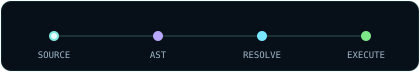
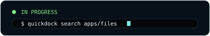

 

<h1 align="center">
  
</h1>

 

 

Building software systems, developer tools, and applications — from interpreters and networking systems to modern desktop software.

  

  

  

 01 / PROJECTS
 

<table>
<tr>
<td width="50%" valign="top">

01
 

### 🐑 Lamb
<b>INTERPRETER</b> · LANGUAGE RUNTIME

Dynamically typed language on the JVM with lexing, parsing, ASTs, resolving, closures, classes, inheritance, and tree-walking evaluation.

 &nbsp; AST · PARSING · OOP

[VIEW REPOSITORY →](https://github.com/deebyanshujha/Lamb) &nbsp;·&nbsp; [DOCS →](https://deebyanshujha.github.io/docs-lamb/)

</td>
<td width="50%" valign="top">

02
 

### ⌘ QuickDock
<b>LAUNCHER</b> · LOCAL-FIRST DESKTOP TOOL

Keyboard-first Windows launcher for apps, files, and folders, built around local indexing, global hotkeys, shell actions, and fast navigation.

 &nbsp; WIN32 · SEARCH

[VIEW REPOSITORY →](https://github.com/deebyanshujha/QuickDock)

</td>
</tr>
<tr>
<td width="50%" valign="top">

03
 

### ◧ WallFlow
<b>DESKTOP</b> · WALLPAPER FLOW

Windows wallpaper manager with scheduled refreshes, smart caching, offline fallback, favorites, and bandwidth-conscious image downloads.

 &nbsp; WINDOWS · CACHING

[VIEW REPOSITORY →](https://github.com/deebyanshujha/WallFlow)

</td>
<td width="50%" valign="top">

04
 

### ∿ ChatterNet
<b>NETWORKING</b> · CONCURRENT TCP

Multi-threaded TCP group chat in C++ with client-server architecture, concurrent users, and real-time message broadcasting.

 &nbsp; SOCKETS · THREADS · TCP

[VIEW REPOSITORY →](https://github.com/deebyanshujha/ChatterNet)

</td>
</tr>
</table>

 

 02 / TECHNOLOGY
 

<table>
<tr>
<td width="25%" valign="top">

**Languages**
  

</td>
<td width="25%" valign="top">

**Frontend**
  

</td>
<td width="25%" valign="top">

**Backend & Data**
  

</td>
<td width="25%" valign="top">

**Systems & Tools**
  

</td>
</tr>
</table>

 

  

 03 / PROBLEM SOLVING
 

<table>
<tr>
<td align="center" width="25%">

## 700+
 DSA PROBLEMS

</td>
<td align="center" width="25%">

## TOP 25%
 [LEETCODE](https://leetcode.com/deebyanshujha/)

</td>
<td align="center" width="25%">

## 2★
 [CODECHEF](https://www.codechef.com/users/deebyanshujha)

</td>
<td align="center" width="25%">

## 6+
 CERTIFICATIONS / BADGES

</td>
</tr>
</table>

 

 04 / EDUCATION
 

<table>
<tr>
<td width="34%" valign="top">

### VIT Vellore
B.TECH — CSE (IOT)
 2024 — 2028

</td>
<td width="22%" align="center" valign="top">

## 9.12 / 10
CGPA

</td>
<td width="22%" align="center" valign="top">

## 91.8%
XII

</td>
<td width="22%" align="center" valign="top">

## 89.8%
X

</td>
</tr>
</table>

 

 05 / CURRENTLY BUILDING
 

<table>
<tr>
<td width="36%" valign="top">

### ⚡ QUICKDOCK
KEYBOARD-FIRST WINDOWS LAUNCHER

  

</td>
<td width="64%" valign="top">

Building a local-first launcher for apps, files, folders, and fast system navigation.

RUST · TAURI · REACT · WINDOWS · LOCAL INDEX

</td>
</tr>
</table>

  

  

 

<b>BUILD. UNDERSTAND. SHIP.</b>

 

Always curious about what happens under the hood.

  

  <a href="https://github.com/deebyanshujha">GitHub</a>
  &nbsp;·&nbsp;
  <a href="https://www.linkedin.com/in/deebyanshujha/">LinkedIn</a>
  &nbsp;·&nbsp;
  <a href="https://my-portfolio-five-beta-27.vercel.app">Portfolio</a>
  &nbsp;·&nbsp;
  <a href="https://leetcode.com/deebyanshujha/">LeetCode</a>

 

 

© DEEBYANSHU JHA

